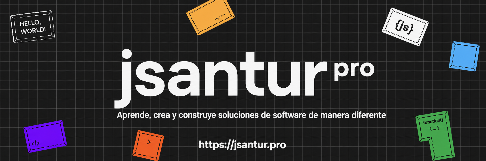

#  Hola, mi nombre es Joseph Santur 👋

  

<!-- Social icons section -->

  

  

  

  

 

>[!NOTE]
Soy desarrollador de software con más de 8 años de experiencia diseñando y construyendo soluciones completas, eficientes y orientadas a resultados. He participado en el desarrollo de aplicaciones web, móviles y sistemas de escritorio empresarial, abarcando todo el ciclo de vida del software: desde la conceptualización hasta la implementación y puesta en producción.

>[!TIP]
Mi enfoque principal está en la arquitectura, consultoría y desarrollo de software, con especial énfasis en Python para la creación de aplicaciones robustas y escalables. Además, integro criterios de diseño gráfico y branding para desarrollar interfaces modernas, intuitivas y centradas en la experiencia del usuario.

>[!IMPORTANT]
He contribuido en diversos proyectos tecnológicos, desarrollando soluciones innovadoras alineadas a las necesidades del cliente. Combino solidez técnica con visión estratégica, lo que me permite construir productos funcionales, escalables y orientados a generar valor real para el negocio.

>[!WARNING]
Me encuentro en constante aprendizaje y evolución profesional, explorando nuevas tecnologías y tendencias para mantenerme actualizado. Mi objetivo es seguir desarrollando soluciones que no solo resuelvan problemas, sino que también generen impacto significativo.

## 🌐 Encuéntrame en

  

 
	  
<h2>Explora mi portafolio profesional</h2>

#### Te presento [jsantur pro](https://jsportfolio-theta.vercel.app/), mi espacio más importante para mostrar mi trayectoria en programación y desarrollo de software.

> **¿Quieres conocer más sobre mí?** Aquí encontrarás mi currículum, proyectos y trabajos realizados, certificaciones, experiencia profesional y las tecnologías con las que trabajo. También podrás descubrir aplicaciones desarrolladas, sitios web, colaboraciones, servicios y mucho más.
> 
> Entra en **[jsantur.pro](https://jsportfolio-theta.vercel.app/)** y descubre todo lo que puedo aportar para transformar ideas en soluciones digitales.

 
	  
<h2>💼 Algunos proyectos destacados</h2>

## Sistema de Reportes MPT | Central de Monitoreo

## Plataforma Web Corporativa CES VALI

## Plataforma Oficial de Verificación de Certificados INAFORP – ESIN

## CADEP Ingenieros | Formación continua

 
## SKILL | ¡Certifica tus habilidades!

 
	  
<h2>▶️ Algunos vídeos en YouTube:</h2>

<table style="width:100%">
<tr>
<td>

</td>
<td>

</td>
<td>

</td>
</tr>
<tr>
<td>

</td>
<td>

</td>
<td>

</td>
</tr>
<tr>
<td>

</td>
<td>

</td>
<td>

</td>
</tr>
</table>

 
  
<h2>🛠️ Mis Herramientas Favoritas</h2>

  <!-- Some badges are from https://github.com/Ileriayo/markdown-badges -->

  <h3>👨‍💻 Lenguajes de Programación y Marcado</h3>

  

      
      
      
      
      
      
      
      
      
      
      
      
      
      
      
      
      
      
      
      
      
      
      
      
  

  <h3>🧰 Frameworks y Librerías</h3>

  

      
      
      
      
      
      
      
      
      
      
      
      
      
      
      
      
      
      
      
      
      
      
      
      
      
  

  <h3>🗄️ Bases de Datos y Servicios de Alojamiento en la Nube</h3>

  

      
      
      
      
      
      
      
      
      
      
      
  

  <h3>💻 Software y Herramientas</h3>

  

      
      
      
      
      
      
      
      
      
      
      
      
      
      
      
      
      
      
      
      
      
      
  

 
  
<h2>📫 Contacto y apoyo:</h2>

¿Proyecto en mente o ganas de colaborar? Contáctame por redes o correo y lo desarrollamos juntos.
 
[-d34a35?style=for-the-badge&logo=gmail&logoColor=white)](mailto:josephsanturm@gmail.com)
 
[%20GRACIAS!-25D366?style=for-the-badge&logo=whatsapp&logoColor=white)](https://wa.me/51977201449?text=Hola%20JSANTUR%20vengo%20de%20GITHUB)
 

	<i>“Cuanto más grande es la prueba, más glorioso es el triunfo.” - Thomas Paine</i>

 
