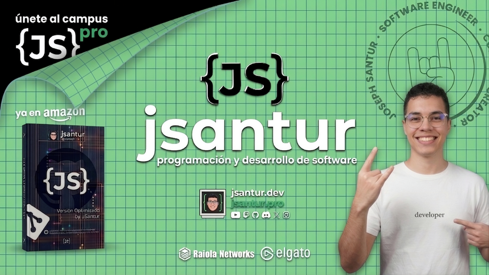

#  Hola, mi nombre es Joseph Santur 👋
### Freelance fullstack iOS & Android engineer

Soy desarrollador de software con más de 8 años de experiencia creando soluciones completas y eficientes. A lo largo de mi trayectoria, he trabajado en el desarrollo de aplicaciones web, móviles y software de escritorio empresarial, participando en proyectos que abarcan desde la conceptualización hasta la implementación final.

Me especializo en arquitectura, consultoría y desarrollo de software, con un enfoque particular en el uso de Python para la creación de aplicaciones robustas tanto en entornos web como de escritorio. Además, integro conocimientos de diseño gráfico y corporativo para desarrollar interfaces modernas, atractivas y centradas en la experiencia del usuario.

He colaborado en diversos proyectos tecnológicos, aportando soluciones innovadoras y adaptadas a las necesidades de cada cliente. Mi enfoque combina la calidad técnica con una visión estratégica, lo que me permite construir productos funcionales, escalables y alineados con los objetivos del negocio.

Actualmente, continúo fortaleciendo mis habilidades y explorando nuevas tecnologías, con el objetivo de seguir creando soluciones que generen impacto y aporten valor real.

# 💼 Algunos proyectos destacados

## CADEP Ingenieros | Formación continua

 

## JavaScript desde cero: Curso gratis

## Git & GitHub desde cero: Curso gratis

## ▶️ Algunos vídeos en YouTube:

<table style="width:100%">
<tr>
<td>

</td>
<td>

</td>
<td>

</td>
</tr>
<tr>
<td>

</td>
<td>

</td>
<td>

</td>
</tr>
<tr>
<td>

</td>
<td>

</td>
<td>

</td>
</tr>
</table>

## 📫 Contacto y apoyo:

¿Proyecto en mente o ganas de colaborar? Contáctame por redes o correo y lo desarrollamos juntos.
 
[-d34a35?style=for-the-badge&logo=gmail&logoColor=white)](mailto:josephsanturm@gmail.com)
 
[%20GRACIAS!-25D366?style=for-the-badge&logo=whatsapp&logoColor=white)](https://wa.me/51977201449?text=Hola%20JSANTUR%20vengo%20de%20GITHUB)
 

	<i>“Cuanto más grande es la prueba, más glorioso es el triunfo.” - Thomas Paine</i>

 
